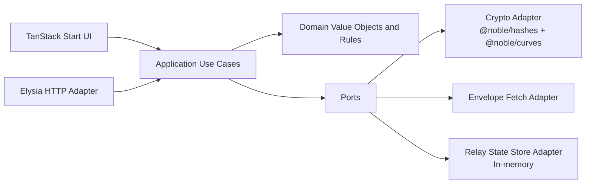

# OnlyDoge DogeConnect Debugger

A modern, protocol-first DogeConnect debugging platform.

This repository gives developers a practical toolkit to validate DogeConnect payloads, exercise relay behavior safely, and understand the protocol deeply enough to ship robust wallet and merchant integrations.

## Contents

- [What This Project Is](#what-this-project-is)
- [Why DogeConnect Matters](#why-dogecoin-connect-matters)
- [Core Capabilities](#core-capabilities)
- [Architecture](#architecture)
- [Tech Stack](#tech-stack)
- [API Surface](#api-surface)
- [OpenAPI](#openapi)
- [MCP Server](#mcp-server)
- [Quick Start](#quick-start)
- [Deployment on Vercel](#deployment-on-vercel)
- [Examples](#examples)
- [Testing](#testing)
- [Tooling](#tooling)
- [Contributing](#contributing)
- [Roadmap](#roadmap)
- [Security and Scope](#security-and-scope)
- [Protocol References](#protocol-references)
- [License](#license)

## What This Project Is

OnlyDoge is an OSS developer platform for DogeConnect that provides:

- Strict QR URI validation
- Strict Payment Envelope validation (including cryptographic verification)
- A no-op relay simulator that follows real relay contract shapes
- An API-first workflow with generated OpenAPI documentation
- A polished web UI built for debugging speed

## Why DogeConnect Matters

Dogecoin by itself is simple to transfer, but production-grade checkout flows need more than a raw payment URI. DogeConnect introduces standardized handshake and relay semantics so wallets, merchants, and relays can communicate with less ambiguity.

### Practical benefits

- Better interoperability between wallet and merchant implementations
- Better status visibility (`accepted`, `confirmed`, `declined`) for user-facing UX
- Better safety compared with URI-only flows by requiring structured relay contracts
- Better testability through deterministic payloads and validation rules

### Adoption impact

Wider DogeConnect adoption can increase the utility of Dogecoin by reducing integration friction and improving payment reliability. Better developer tooling accelerates this adoption by making failures explicit and reproducible.

## Core Capabilities

### 1) QR URI Validator

- Parses `dogecoin:` URIs
- Enforces DogeConnect `dc`/`h` pair behavior
- Distinguishes non-connect URIs from malformed connect URIs
- Optionally fetches envelope from relay endpoint and validates it end-to-end
- Includes live QR code preview as URI text changes
- Includes branded QR image download for sharing/testing artifacts

### 2) Payment Envelope Validator

- Validates envelope structure (`version`, `payload`, `pubkey`, `sig`)
- Decodes and validates payment payload shape
- Verifies BIP-340 Schnorr signature using noble crypto libs
- Supports optional expected hash matching against URI `h`

### 3) Relay Debugger (No-op Contract Simulator)

- Register scenario per payment ID (`accepted`, `confirmed`, `declined`, `error`)
- Exercise `relay/pay` and `relay/status` exactly through API contracts
- Inspect scenario transitions and in-memory state in the UI
- Reset state quickly for iterative integration testing

### 4) Mock Fixture Generator

- Generates valid DogeConnect QR URIs on demand
- Returns matching signed envelopes for `dc` fetch testing
- Accelerates wallet/merchant integration and regression debugging

## Architecture

This project is a modular monolith with Hexagonal (Ports and Adapters) boundaries and DDD-inspired layering.

Dependency direction is intentionally one-way:

- `domain` <- `application` <- `adapters`

Mermaid overview:



Current module layout:

```text
src/modules/dogeconnect/
  domain/
    entities/
    shared/
    value-objects/
  application/
    use-cases/
    contracts.ts
  ports/
  adapters/
    crypto/
    outbound/
    relay/
    http/
  presentation/
```

Key domain concepts implemented as value objects and invariants include:

- `DogeUri`
- `RelayUrl`
- `RelayPubKeyHash`
- `ConnectEnvelope`
- `ConnectPayment`
- `PaymentSubmission`
- `PaymentStatus`
- `KoinuAmount`
- `Rfc3339Timestamp`

## Tech Stack

- Frontend: React 19, TanStack Start, TanStack Router, TanStack Query, TanStack Form
- UI: Shadcn-style components, Tailwind CSS v4
- API: Elysia + `@elysiajs/openapi`
- Crypto: `@noble/hashes`, `@noble/curves`
- Runtime and language: Bun + TypeScript
- Testing: Vitest + Testing Library
- Lint and format: Biome

## API Surface

Base URL: `/api`

### Validation tools

- `POST /api/tools/validate-qr`
  - Request: `{ uri: string, fetchEnvelope?: boolean }`
  - Response: `{ verdict, parsed, checks, errors, envelopeValidation? }`

- `POST /api/tools/validate-envelope`
  - Request: `{ envelope: unknown, expectedHash?: string }`
  - Response: `{ verdict, envelope, payment, checks, errors }`

### Mock fixtures

- `POST /api/tools/mock-qr`
  - Request: `{ paymentId?: string }`
  - Response: `{ uri, paymentId, dc, h, envelope, payment, ... }`
  - Purpose: return a ready-to-scan/test QR URI whose `dc` points to this app's mock envelope endpoint

- `GET /api/tools/mock-envelope/:paymentId`
  - Response: `ConnectEnvelope` (`{ version, payload, pubkey, sig }`)
  - Purpose: backing endpoint referenced by generated mock `dc` values

### Relay simulator

- `POST /api/relay/pay`
  - Request: `{ id, tx, refund?, relay_token? }`
  - Response: `PaymentStatusResponse | ErrorResponse`

- `POST /api/relay/status`
  - Request: `{ id }`
  - Response: `PaymentStatusResponse | ErrorResponse`

### Relay debug controls

- `POST /api/relay/debug/payment`
- `GET /api/relay/debug/payments`
- `POST /api/relay/debug/reset`

## OpenAPI

- Interactive docs: `/api/openapi`
- JSON spec: `/api/openapi/json`

OpenAPI is generated directly from Elysia route contracts, so docs stay synchronized with handler schemas.

## MCP Server

This project exposes a Model Context Protocol (MCP) server endpoint for AI-assisted DogeConnect debugging.

- MCP endpoint: `/mcp`
- Transport: JSON-RPC 2.0 over HTTP (`POST /mcp`)
- Metadata: `GET /mcp`
- Protocol version: `2024-11-05`

### MCP tool catalog

- `validate_dogeconnect_uri`
- `validate_payment_envelope`
- `generate_mock_qr_fixture`
- `build_flight_recorder_session`
- `flight_recorder_step_status`
- `flight_recorder_step_pay`
- `register_relay_scenario`
- `reset_relay_state`

These tools are designed so agent tool calls can inspect each protocol stage independently (URI parse, envelope checks, relay setup, and end-to-end flow execution).

### MCP JSON-RPC examples

Initialize:

```bash
curl -X POST http://localhost:3000/mcp \
  -H 'Content-Type: application/json' \
  -d '{
    "jsonrpc":"2.0",
    "id":1,
    "method":"initialize",
    "params":{}
  }'
```

List tools:

```bash
curl -X POST http://localhost:3000/mcp \
  -H 'Content-Type: application/json' \
  -d '{
    "jsonrpc":"2.0",
    "id":2,
    "method":"tools/list",
    "params":{}
  }'
```

Call a tool:

```bash
curl -X POST http://localhost:3000/mcp \
  -H 'Content-Type: application/json' \
  -d '{
    "jsonrpc":"2.0",
    "id":3,
    "method":"tools/call",
    "params":{
      "name":"build_flight_recorder_session",
      "arguments":{
        "sourceMode":"mock",
        "targetMode":"simulator",
        "includeInitialStatus":false
      }
    }
  }'
```

## Quick Start

### Prerequisites

- Node.js `>=20.19` (needed by crypto dependencies)
- Bun `>=1.3`

### Install

```bash
bun install
```

### Run dev server

```bash
bun run dev
```

Then visit:

- App: [http://localhost:3000](http://localhost:3000)
- Tools page: [http://localhost:3000/tools](http://localhost:3000/tools)
- OpenAPI docs: [http://localhost:3000/api/openapi](http://localhost:3000/api/openapi)

## Deployment on Vercel

This project is intended to be hosted on Vercel.

Recommended settings:

- Install command: `bun install`
- Build command: `bun run build`
- Node.js runtime: `20+`

After importing the repository into Vercel, keep framework detection defaults unless your team needs custom overrides.

### MCP deployment options

1. **Same deployment (recommended default)**  
   Keep MCP under the existing app and use:
   - `https://<your-app-domain>/mcp`

2. **Dedicated MCP subdomain**
   - Create a Vercel domain alias such as `mcp.connect.onlydoge.io`.
   - Point it to this same deployment (or a second deployment of this repo).
   - Use:
     - `https://mcp.connect.onlydoge.io/mcp`

If your MCP client requires root-path hosting, configure a Vercel rewrite in that dedicated project to route `/` to `/mcp`.

## Examples

### Generate a valid mock QR URI

```bash
curl -X POST http://localhost:3000/api/tools/mock-qr \
  -H 'Content-Type: application/json' \
  -d '{"paymentId":"demo-001"}'
```

You can extract only the URI value with:

```bash
curl -s -X POST http://localhost:3000/api/tools/mock-qr \
  -H 'Content-Type: application/json' \
  -d '{}' | jq -r '.uri'
```

### Validate a QR URI

```bash
curl -X POST http://localhost:3000/api/tools/validate-qr \
  -H 'Content-Type: application/json' \
  -d '{
    "uri": "dogecoin:DPD7uK4B1kRmbfGmytBhG1DZjaMWNfbpwY?amount=12.25&dc=example.com%2Fdc%2Fid&h=72b-LVh5K_mm7zyN9PXO",
    "fetchEnvelope": true
  }'
```

### Validate an envelope

```bash
curl -X POST http://localhost:3000/api/tools/validate-envelope \
  -H 'Content-Type: application/json' \
  -d '{
    "expectedHash": "72b-LVh5K_mm7zyN9PXO",
    "envelope": {
      "version": "1.0",
      "payload": "<base64>",
      "pubkey": "<hex32>",
      "sig": "<hex64>"
    }
  }'
```

### Register relay scenario and test pay/status

```bash
curl -X POST http://localhost:3000/api/relay/debug/payment \
  -H 'Content-Type: application/json' \
  -d '{"id":"pay-101","scenario":"accepted","required":6,"dueSec":600}'

curl -X POST http://localhost:3000/api/relay/pay \
  -H 'Content-Type: application/json' \
  -d '{"id":"pay-101","tx":"deadbeef"}'

curl -X POST http://localhost:3000/api/relay/status \
  -H 'Content-Type: application/json' \
  -d '{"id":"pay-101"}'
```

## Testing

Run the full test suite:

```bash
bun run test
```

Current coverage includes:

- Domain value object parsing and invariants
- Envelope validation use-case behavior
- Elysia API integration paths (relay and OpenAPI)
- Tools page server-render sanity

## Tooling

This project uses Biome for linting and formatting.

Available scripts:

- `bun run dev`
- `bun run build`
- `bun run preview`
- `bun run typecheck`
- `bun run test`
- `bun run lint`
- `bun run format`
- `bun run check`

## Contributing

Contributions are welcome.

Recommended flow:

1. Fork the repository.
2. Create a feature branch.
3. Implement your change with tests.
4. Run quality gates.
5. Open a PR with context and evidence.

Quality gate commands:

```bash
bun run check
bun run typecheck
bun run test
```

Contribution expectations:

- Respect architecture boundaries (`domain` should not depend on adapters)
- Implement behavior in explicit use-case services, not route-level ad-hoc logic
- Include tests for protocol behavior changes
- Keep API contracts reflected in OpenAPI

See full contribution guidelines in [CONTRIBUTING.md](./CONTRIBUTING.md).

## Roadmap

- Persistence adapter for relay state (SQLite/Postgres)
- More protocol fixtures aligned with `dogeconnect-go` test vectors
- Additional UI workflows for batch validation and replay
- Optional import/export of debug sessions
- Stronger contract-level compatibility test suite

## Security and Scope

- This project is a developer tool, not a production wallet.
- Treat simulator output as test feedback, not settlement truth.
- Validate all integrations in secure staging before mainnet use.

If you discover a security issue, please report responsibly rather than opening a public exploit issue.

## Protocol References

- DogeConnect intro: [https://connect.dogecoin.org/getting_started/introduction.html](https://connect.dogecoin.org/getting_started/introduction.html)
- QR URI spec: [https://connect.dogecoin.org/payment_gateway/qrcode_uri.html](https://connect.dogecoin.org/payment_gateway/qrcode_uri.html)
- Payment envelope spec: [https://connect.dogecoin.org/payment_gateway/payment_envelope.html](https://connect.dogecoin.org/payment_gateway/payment_envelope.html)
- Relay contract: [https://connect.dogecoin.org/payment_relay/relay.html](https://connect.dogecoin.org/payment_relay/relay.html)

## License

This project is licensed under the MIT License.

See [LICENSE](./LICENSE).
